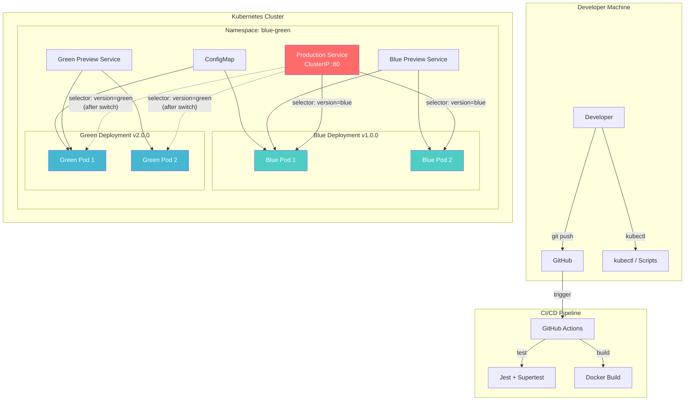
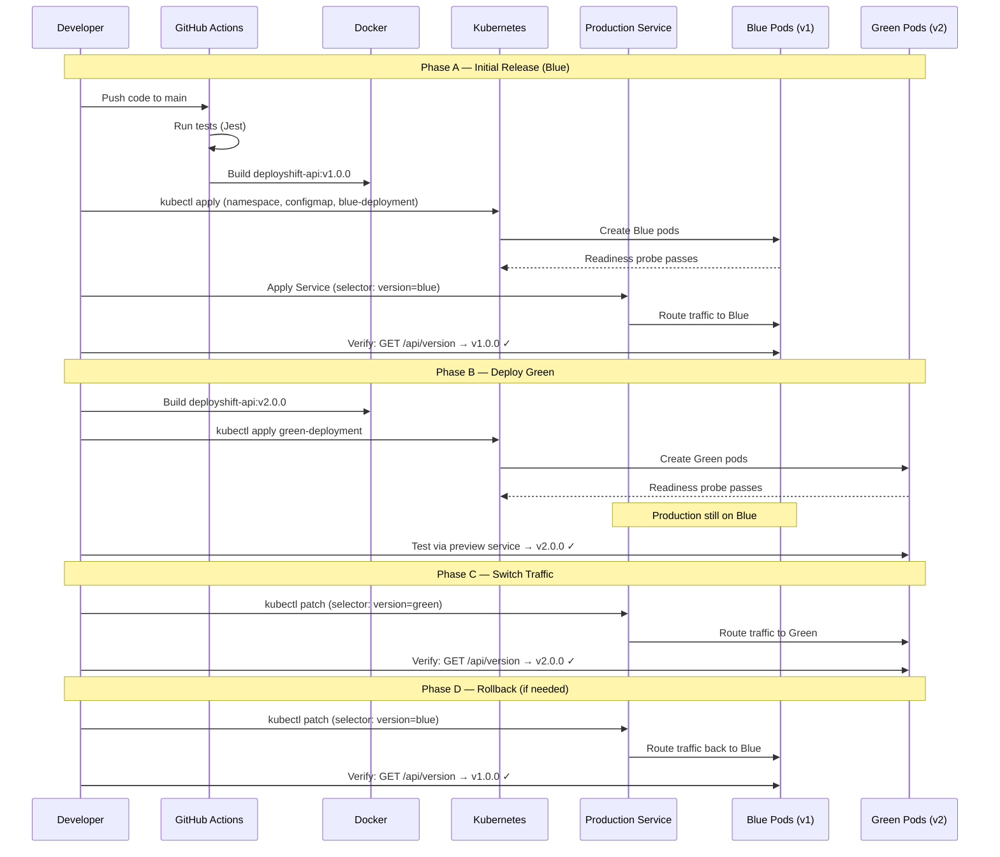

# DeployShift — Blue-Green Deployment Demo API

## Architecture Diagram

```mermaid
graph TB
    subgraph "Developer Machine"
        DEV[Developer] --> |git push| GH[GitHub]
        DEV --> |kubectl| K8S
    end
    
    subgraph "CI/CD Pipeline"
        GH --> |trigger| GA[GitHub Actions]
        GA --> |test| TESTS[Jest + Supertest]
        GA --> |build| DOCKER[Docker Build]
    end
    
    subgraph "Kubernetes Cluster"
        K8S[kubectl / Scripts]
        
        subgraph "Namespace: blue-green"
            SVC[Production Service<br/>ClusterIP :80]
            
            subgraph "Blue Deployment v1.0.0"
                B1[Blue Pod 1]
                B2[Blue Pod 2]
            end
            
            subgraph "Green Deployment v2.0.0"
                G1[Green Pod 1]
                G2[Green Pod 2]
            end
            
            BPREV[Blue Preview Service]
            GPREV[Green Preview Service]
            CM[ConfigMap]
        end
    end
    
    SVC --> |"selector: version=blue"| B1
    SVC --> |"selector: version=blue"| B2
    SVC -.-> |"selector: version=green<br/>(after switch)"| G1
    SVC -.-> |"selector: version=green<br/>(after switch)"| G2
    
    BPREV --> B1
    BPREV --> B2
    GPREV --> G1
    GPREV --> G2
    
    CM --> B1
    CM --> G1

    style SVC fill:#ff6b6b,color:#fff
    style B1 fill:#4ecdc4,color:#fff
    style B2 fill:#4ecdc4,color:#fff
    style G1 fill:#45b7d1,color:#fff
    style G2 fill:#45b7d1,color:#fff
```

## Deployment Sequence Diagram

```mermaid
sequenceDiagram
    participant Dev as Developer
    participant CI as GitHub Actions
    participant Docker as Docker
    participant K8s as Kubernetes
    participant Svc as Production Service
    participant Blue as Blue Pods (v1)
    participant Green as Green Pods (v2)
    
    Note over Dev,Green: Phase A — Initial Release (Blue)
    Dev->>CI: Push code to main
    CI->>CI: Run tests (Jest)
    CI->>Docker: Build deployshift-api:v1.0.0
    Dev->>K8s: kubectl apply (namespace, configmap, blue-deployment)
    K8s->>Blue: Create Blue pods
    Blue-->>K8s: Readiness probe passes
    Dev->>Svc: Apply Service (selector: version=blue)
    Svc->>Blue: Route traffic to Blue
    Dev->>Blue: Verify: GET /api/version → v1.0.0 ✓
    
    Note over Dev,Green: Phase B — Deploy Green
    Dev->>Docker: Build deployshift-api:v2.0.0
    Dev->>K8s: kubectl apply green-deployment
    K8s->>Green: Create Green pods
    Green-->>K8s: Readiness probe passes
    Note over Svc,Blue: Production still on Blue
    Dev->>Green: Test via preview service → v2.0.0 ✓
    
    Note over Dev,Green: Phase C — Switch Traffic
    Dev->>Svc: kubectl patch (selector: version=green)
    Svc->>Green: Route traffic to Green
    Dev->>Green: Verify: GET /api/version → v2.0.0 ✓
    
    Note over Dev,Green: Phase D — Rollback (if needed)
    Dev->>Svc: kubectl patch (selector: version=blue)
    Svc->>Blue: Route traffic back to Blue
    Dev->>Blue: Verify: GET /api/version → v1.0.0 ✓
```
